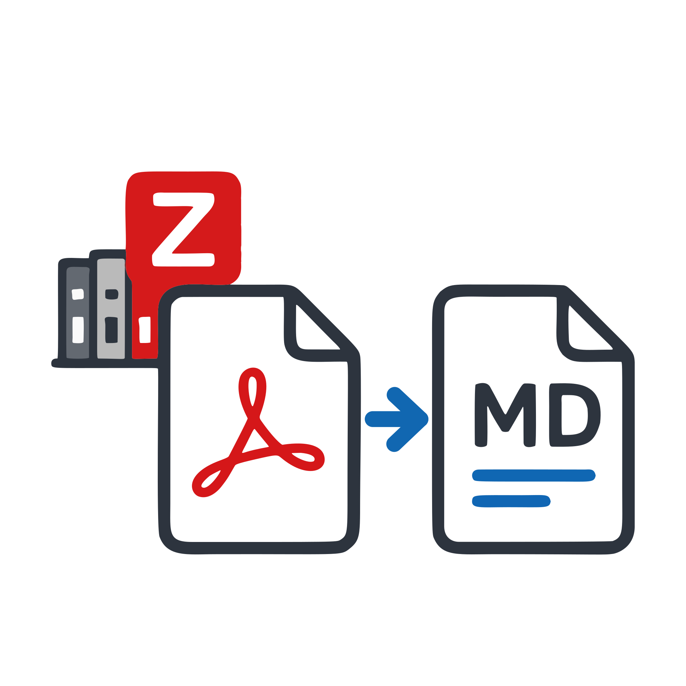
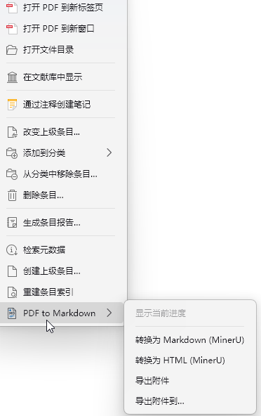
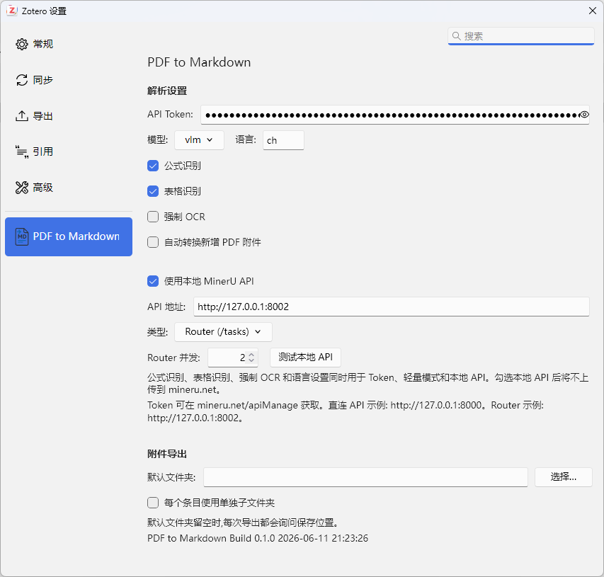

# PDF to Markdown

<p align="center">
  
</p>

<p align="center">
  <a href="https://github.com/LuckYang1/PDF-to-md/actions/workflows/ci.yml"></a>
  <a href="https://github.com/LuckYang1/PDF-to-md/releases"></a>
  <a href="https://github.com/LuckYang1/PDF-to-md/blob/main/LICENSE"></a>
  
  
</p>

<!-- README-I18N:START -->

[English](./README-en.md) | **中文**

<!-- README-I18N:END -->

PDF to Markdown 是一个 Zotero 插件，用于把 Zotero 条目中的 PDF 附件转换为
Markdown 或 HTML，并支持导出附件文件。

转换由 MinerU 完成，支持三种模式：

- Token API：填写 MinerU API Token 后走 `https://mineru.net/api/v4`。
- 轻量模式：未填写 Token 且未启用本地 API 时使用 MinerU 轻量接口。
- 本地 API：启用后走本地 MinerU API / Router，默认 Router 地址为
  `http://127.0.0.1:8002`。

[下载最新版 XPI](https://github.com/LuckYang1/PDF-to-md/releases/download/v0.1.0/pdf-to-markdown.xpi)
| [查看 Release](https://github.com/LuckYang1/PDF-to-md/releases/latest)

## MinerU 资源

- 本地部署参考：
  [MinerU README_zh-CN.md](https://github.com/opendatalab/MinerU/blob/master/README_zh-CN.md)。
- API 申请与文档：
  [MinerU API Manage Docs](https://mineru.net/apiManage/docs)。

## 功能

| 右键菜单                                             | 设置界面                                               |
| ---------------------------------------------------- | ------------------------------------------------------ |
|  |  |

- 右键条目或 PDF 附件，通过 `PDF to Markdown` 子菜单执行操作。
- 支持 `转换为 Markdown (MinerU)`。
- 支持 `转换为 HTML (MinerU)`。
- 普通条目下有多个 PDF 时，会弹窗选择具体要解析的 PDF。
- 转换结果作为 Zotero 附件保存到原条目下。
- Markdown 结果会复制配套 `images/` 目录，保持相对图片链接可用。
- HTML 结果优先从 MinerU ZIP 中的 Markdown 生成，并把图片嵌入为 data URL。
- 支持新增 PDF 自动转换为 Markdown。
- 支持导出附件到默认目录或临时选择目录。
- 右下角显示转换进度，支持最小化和从右键菜单恢复。

## 安装

### 从 GitHub Release 安装

1. 打开 [最新版 Release](https://github.com/LuckYang1/PDF-to-md/releases/latest)。
2. 下载 `pdf-to-markdown.xpi`。
3. 打开 Zotero。
4. 进入 `Tools -> Plugins`。
5. 点击齿轮菜单，选择 `Install Add-on From File...`。
6. 选择刚下载的 `.xpi` 文件并重启 Zotero。

### 从插件市场安装

如果 Add-on Market for Zotero 已经收录本插件，也可以在插件市场中搜索 `PDF to Markdown`
并安装。

## 开发

本仓库基于 `zotero-plugin-scaffold`。

首次安装依赖：

```powershell
npm install
```

开发启动：

```powershell
npm start
```

当前本地 `.env` 可指向独立 Zotero 开发 profile。模板文件为 `.env.example`。

构建 XPI：

```powershell
npm run build
```

构建产物位于：

```text
.scaffold/build/pdf-to-markdown.xpi
```

静态检查：

```powershell
npm run lint:check
```

## 自动更新和发布

插件 manifest 会在构建时注入更新地址：

```text
https://github.com/LuckYang1/PDF-to-md/releases/download/release/update.json
```

推送 `v*` tag 会触发 GitHub Actions 发布流程。工作流会构建 XPI，把它上传到对应版本的
GitHub Release，并刷新固定 `release` tag 下的 `update.json` 资产，供 Zotero 检查更新。

示例：

```powershell
git tag v0.1.1
git push origin v0.1.1
```

## 设置

在 Zotero 设置页中打开 `PDF to Markdown`：

- `API Token`：MinerU Token；留空时可走轻量模式。
- `模型`：`vlm` 或 `pipeline`。
- `语言`：默认 `ch`，英文可填 `en`。
- `公式识别`、`表格识别`、`强制 OCR`：同时用于 Token、轻量和本地 API 模式。
- `使用本地 MinerU API`：启用后不会上传到 mineru.net。
- `API 地址`：Router 默认 `http://127.0.0.1:8002`，直连 API 通常为
  `http://127.0.0.1:8000`。
- `Router 并发`：本地 Router 模式并发数，默认 `2`。
- `默认文件夹`：附件导出的默认目录。

## 代码结构

- `src/modules/pdfToMd.ts`：菜单、队列、转换流程、进度面板、附件导出。
- `src/modules/renderHtml.ts`：Markdown / MinerU ZIP 到 HTML 的基础渲染。
- `addon/content/preferences.xhtml`：Zotero 偏好设置页。
- `addon/prefs.js`：默认偏好值。
- `addon/locale/*`：中英文界面文案。

## 注意

- 插件 ID 为 `pdf-to-md@local`。
- 偏好前缀为 `extensions.zotero.pdftomd`。

## 感谢

本项目参考了下列作者的思路，感谢社区做出的贡献：

- [PDF to Markdown for Zotero](https://github.com/qingpy/zotero-pdf2md)
- [MinerU HTML Parser for Zotero](https://github.com/understandlxy/mineru-html-parser-zotero)
- [Zotero MinerU Parser](https://github.com/lisontowind/zotero-mineru)

## License

本项目使用 [AGPL-3.0-or-later](./LICENSE) 许可证。
